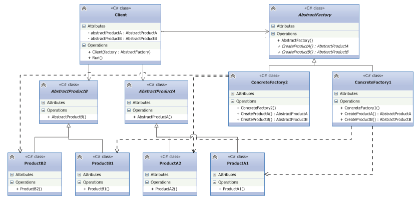

## Definition
The Abstract Factory Design Pattern provides a way to encapsulate a group of factories with a common theme without specifying their concrete classes.
Abstract Factory Pattern is a software design pattern that provides a way to encapsulate a group of individual factories that have a common theme.
## UML Diagram 

## Abstract Factory in our example
The Abstract Factory design pattern provides an interface for creating families of related or dependent products but leaves the actual object creation to the concrete factory classes.
In our example, the classes have the following hierarchy:
1) `CourseFactory` serves a base class for all factories that are responsible for creating their own category of courses.
2) `BackendCourseFactory` inherits CourseFactory, and thus creates its own category of courses(backend courses)
3) BackendCourseFactory can create its own backend-related courses(e.g. Java, Python courses)
4) The same works for FrontendCourseFactory

### Expandability
If we were to add courses related to `DevOps` category, we would need to define
1) `DevOpsCourseFactory` that can contain different methods like: `CreateCiCdCourse`, `CreateDockerCourse`, etc. 
2) And each course can have their own classes for description purposes(e.g. `DockerCourse` class, `CiCdCourse` class).
### What should I keep in mind
The Abstract Factory Design Pattern consists of the following components:

* `AbstractFactory`: Declares an interface for operations that create abstract products. This will be an interface for operations that will create Abstract Product objects.
* `ConcreteFactory`: Implements the operations to create concrete product objects. These classes implement the Abstract Factory interface and provide implementations for the interface methods. We can use these concrete classes to create concrete product objects.
* `AbstractProduct`: Declares an interface for a type of product object. These are going to be interfaces for creating abstract products. Here, we need to define the Operations a Product should have.
* `ConcreteProduct`: Implements the AbstractProduct interface. These are the classes that implement the Abstract Product interface.
* `Client`: Uses interfaces declared by AbstractFactory and AbstractProduct classes. This class will use our Abstract Factory and Abstract Product interfaces to create a family of products.