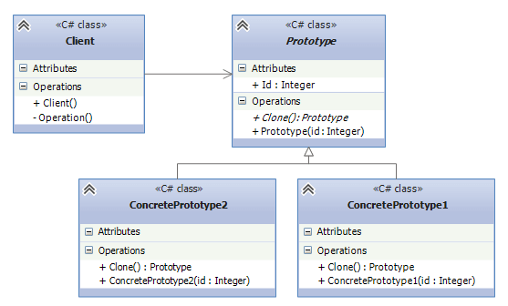

## Prototype
Prototype Design Pattern specifies the kind of objects to create using a prototypical instance and creates new objects by copying this prototype.
It just offers the cloning technique for objects.

## When to use ?
If you have a project where client might work with copying the same product or object consider using this pattern.
## MemberwiseClone
In C#, `MemberwiseClone()` is a method defined in `System.Object` class, but unlike regular methods like `ToString()`,
this method has the access modifier `protected`. From [MSDN](https://learn.microsoft.com/en-us/dotnet/api/system.object.memberwiseclone?view=net-9.0):

The MemberwiseClone method creates a shallow copy by creating a new object,
and then copying the nonstatic fields of the current object to the new object.
If a field is a value type, a bit-by-bit copy of the field is performed. If a field is
 a reference type, the reference is copied but the referred object is not; therefore,
  the original object and its clone refer to the same object.

To illustrate the difference between a shallow and a deep copy operation, consider an object called X that references objects A and B. Object B, in turn, references object C. A shallow copy of X creates new object X2 that also references objects A and B. In contrast, a deep copy of X creates a new object X2 that references the new objects A2 and B2, which are copies of A and B. B2, in turn, references the new object C2, which is a copy of C.

## Example
In our example, the pattern `Prototype` is shown through the example of `Paint` app. In the `Paint`, sometimes
we want to copy the figure that we just created.

