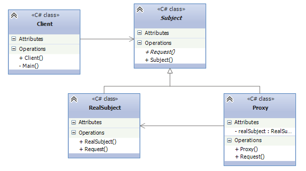

## Proxy
The Proxy Design Pattern is a structural pattern that provides a surrogate or placeholder for another
object to control access to it. This pattern is useful when you want to add an additional layer of control,
security, or optimization before accessing the actual object.

## Proxy types
* Virtual Proxy - a placeholder for objects that are expensive to create. The real object object is created
when a client first accesses the object. In the cases if the request can be handled by proxy object, the
request isn't delivered to the real object.
* Remote Proxy - a proxy the real object of which resides in different address space. Usage of proxy can
decrease the latency when the data is sent through the net. 
* Protection Proxy - a proxy which sends request to the object that contains sensible data. A Proxy
checks accessor's rights/roles, and for the case if the user doesn't have a right, doesn't forward the 
request to the real object. 
* Logging Proxy - a proxy that records the operations performed on the real object.
* Cache Proxy - a proxy, that caches the result of the request to the real object.
* Firewall Proxy - a proxy, that restricts the number of requests going to the Real object.
* Counting Proxy - a proxy, that counts the number of references to the real object. Is important for 
resource management, e.g. a reference-counting proxy tracking the number of clients using a shared resource
(e.g., database connection pool).

## UML diagram

* Subject - defines a common interface for Proxy and RealSubject.
* RealSubject - defines a real object, to which the Proxy is created.
* Proxy - a placeholder to the real object. Contains a reference to the real object, decides whether to
forward the request to the real object or not. 
* Client - uses Proxy object to access RealSubject.

## Example
Imagine you are withdrawing a money from the ATM. As you enter your credentials, you have an access to
the ATM, otherwise you are not. From our example,
* IBankAccount - Subject. Defines an interface(functionality) for the basic operations in the ATM.
* BankAccount - RealSubject. This is the real account of the user, but it doesn't know his credentials as
it is not RealSubject's responsibility. Implements the IBankAccount interface with the balance a user has.
* BankAccountProxy - Proxy. Check's user rights if he can access the account, and if it doesn't match
denies the access to the resource.
* User - a simple client who wants to access the account. 

## When should I use the Proxy pattern ?
* When you want to control access based on user roles or permissions.
* When the creation of an object is resource-intensive (e.g., database connections, large objects).
* When you want to add functionality such as logging, caching, or monitoring without modifying the original object.
* When you need to act as a firewall, filtering and monitoring requests before they reach the target object.
* When you need to track the number of references to an object for resource management.
* When you need to optimize expensive operations